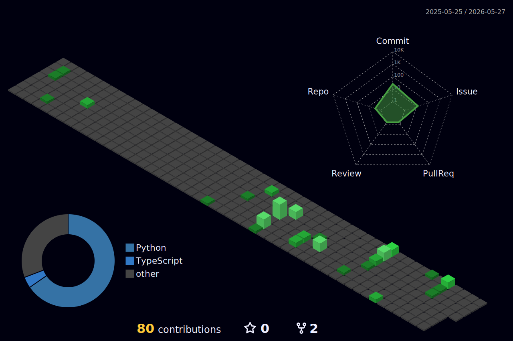

<!-- Profile Header -->
<h1 align="center">Hi there 👋 I'm rmic</h1>

## 👨‍💻 About Me

I'm a **Data Engineer** and **MLOps Engineer** with a strong background in interoperable **healthcare data**, and a growing passion for **Geospatial Data, GIS, and drone-based aerial imagery**.

I enjoy working at the intersection of **data engineering, open data, and real-world operational domains**, especially healthcare and emergency services. Recently, I’ve been actively learning and building tools around **GIS, OpenStreetMap, and spatial analysis**, often combining them with my existing experience in data pipelines, automation, and standards.

- 💡 **Core interests**: Data Engineering, MLOps, Health Data Standards, Automation  
- 🌍 **New focus**: Geospatial data, GIS tooling, OpenStreetMap, aerial imagery (drones)
- 🚑 **Applied domains**: Healthcare, emergency medical services, fire & rescue, civil protection
- 🤝 **Open to collaborate** on projects at the crossroads of data engineering, health, and geospatial analysis

---

## 🌍 Geospatial & GIS Interests

I’m currently exploring how **open geospatial data and GIS tools** can improve the **quality, accuracy, and usability of emergency-related datasets**.

In particular:
- 🗺️ Mapping and validating **ambulance stations, fire stations, and emergency services** in **OpenStreetMap**
- 🧩 Developing **QGIS plugins** to support data conflation, validation, and enrichment workflows
- 🚁 Learning about **drone-based aerial imagery** and its integration into GIS pipelines
- 🔗 Bridging **healthcare & emergency response data** with spatial analysis

One concrete outcome of this work is a **QGIS plugin** I’m currently developing to help improve OSM data quality for emergency infrastructure.

---

## 🛠️ Skills and Technologies

### Languages & Tools

### Geospatial & Open Data (learning & practice)

### Health Data Standards

---

## 🚀 Projects

🚧 **Under construction** 🚧  

- **QGIS Plugin – OSM Conflation Bridge**  
  Tooling to assist in the conflation and validation of emergency-related infrastructure (ambulance stations, fire stations, emergency services) in OpenStreetMap, with a focus on data quality and real-world operational relevance.
- **GCP Editor**
  A simple yet functional GCP (Ground Control Point) file editor that helps pinpoint drone aerial imagery on a map to create georeferenced orthomosaics using any drone.
- **Mapping Tournai / Mapillarization**
  An ongoing local mapping project to improve street-level imagery and OpenStreetMap coverage around Tournai. It combines Mapillary captures, PostGIS analysis, QGIS review, and a small public Hugo site to track coverage progress and field notes: [mapping-tournai.be](https://mapping-tournai.be).

---

## 🤝 Let's Connect

I'm always interested in collaborating on meaningful projects or exchanging ideas around **data engineering, healthcare, GIS, and open data**.  
Feel free to reach out!

---

## My stats

