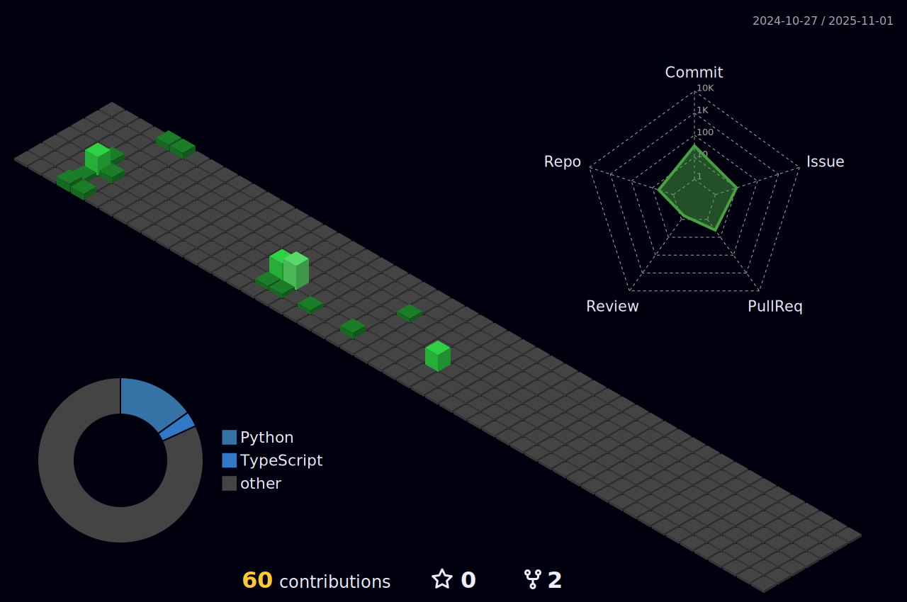

<!-- Profile Header -->
<h1 align="center">Hi there 👋 I'm rmic</h1>

## 👨‍💻 About Me

I'm a **Data Engineer** and **MLOps Engineer** with a passion for health related data ! I love working with cutting-edge technologies, solve complex data problems, improve data integration and management, resulting in better healthcare outcomes.

- 💡 **Interests**: Data Management/Engineering, Building Data pipelines, Automating Machine Learning Operations, Health Data Standards, 
- 🤝 **Open to Collaborate** on projects related to data engineering, MLOps, and health informatics

## 🛠️ Skills and Technologies


<!-- Projects -->
## 🚀 Projects
```
-- UNDER CONSTRUCTION -- 
```

## 🤝 Let's Connect

I'm always interested in collaborating on exciting projects or discussing new ideas. Feel free to reach out!

<!--
**rmic/rmic** is a ✨ _special_ ✨ repository because its `README.md` (this file) appears on your GitHub profile.

- 🌱 **Currently Learning**: dbt, OpenMetadata, FHIR, HL7, OMOP, ICD-10, LOINC, SNOMED
Here are some ideas to get you started:

- 🔭 I’m currently working on ...
- 🌱 I’m currently learning ...
- 👯 I’m looking to collaborate on ...
- 🤔 I’m looking for help with ...
- 💬 Ask me about ...
- 📫 How to reach me: ...
- 😄 Pronouns: ...
- ⚡ Fun fact: ...
-->

## My stats

